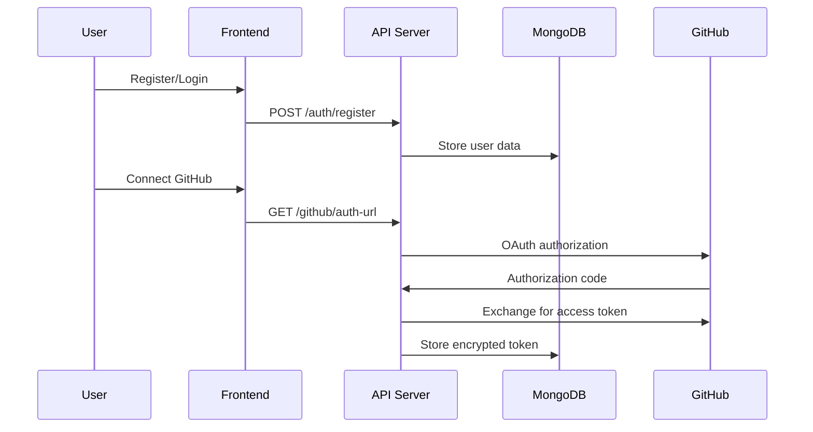
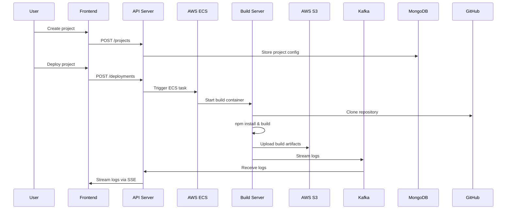
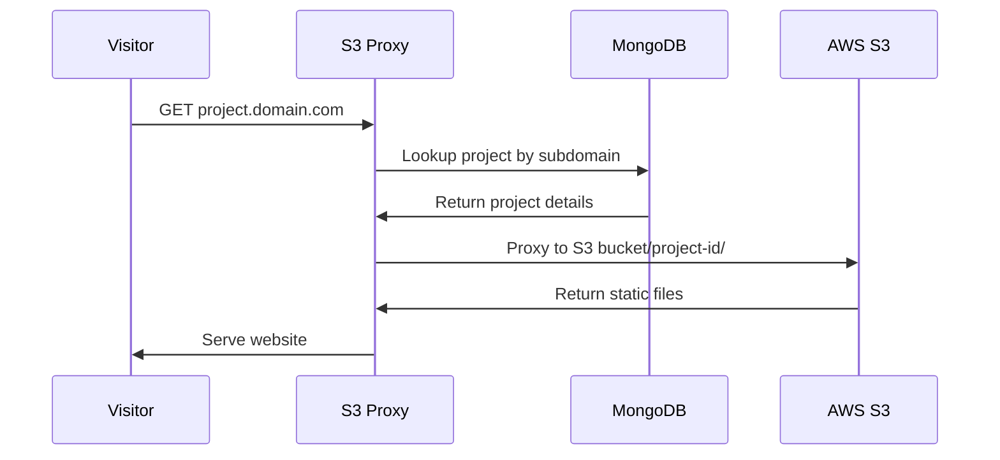

# SnapDeploy - Technical Architecture and Workflow Guide 🏗️

This document provides a detailed technical breakdown of how SnapDeploy works, its architecture, and complete deployment workflow.

## 📋 Table of Contents

1. [System Overview](#system-overview)
2. [Architecture Components](#architecture-components)
3. [Data Flow](#data-flow)
4. [API Endpoints](#api-endpoints)
5. [Deployment Workflow](#deployment-workflow)
6. [Technology Stack Details](#technology-stack-details)
7. [Security Architecture](#security-architecture)
8. [Integration Points](#integration-points)

## 🎯 System Overview

SnapDeploy is a **cloud-native deployment platform** that automates the process of deploying static websites from GitHub repositories to AWS S3, with custom subdomain routing through a reverse proxy.

### Core Problem Solved
- **Manual Deployment Complexity**: Eliminates the need to manually clone, build, and deploy repositories
- **Infrastructure Management**: Abstracts away AWS S3 setup, bucket configuration, and routing
- **Build Environment**: Provides consistent, containerized build environments for all projects
- **Real-time Monitoring**: Offers live deployment progress tracking and logging

## 🏗️ Architecture Components

### 1. Frontend Service (React SPA)
```
Technology: React 18 + Vite + Tailwind CSS
Port: 5173 (dev) / 3000 (prod)
Purpose: User Interface and Experience
```

**Key Features:**
- **Authentication UI**: Login, registration, GitHub OAuth integration
- **Project Management**: Create, configure, and manage deployment projects
- **Repository Browser**: GitHub repository selection with branch picker
- **Real-time Dashboard**: Live deployment logs via Server-Sent Events (SSE)
- **Environment Configuration**: Environment variables and build settings management

**Key Files:**
- `src/App.jsx` - Main application router and authentication state
- `src/components/GitHubRepositorySelector.jsx` - GitHub repo integration
- `src/pages/CreateProject.jsx` - Project creation workflow
- `src/pages/ProjectDetail.jsx` - Deployment monitoring and logs

### 2. API Server (Express.js Backend)
```
Technology: Node.js + Express + MongoDB
Port: 8000 (default)
Purpose: Business Logic and Data Management
```

**Core Responsibilities:**
- **User Management**: Registration, login, JWT authentication
- **GitHub Integration**: OAuth flow, repository access, token management
- **Project CRUD**: Create, read, update, delete project configurations
- **Deployment Orchestration**: Trigger AWS ECS build tasks
- **Real-time Logging**: Stream build logs via SSE

**Key Files:**
- `app.js` - Express application setup and middleware
- `controllers/github.controller.js` - GitHub OAuth and API integration
- `controllers/project.controller.js` - Project management logic
- `controllers/deployment.controller.js` - Build triggering and monitoring
- `services/github.service.js` - GitHub API wrapper with encryption
- `models/project.model.js` - MongoDB project schema

### 3. Build Server (Containerized Builder)
```
Technology: Docker + Node.js + AWS ECS Fargate
Purpose: Isolated Build Environment
```

**Build Process:**
1. **Repository Cloning**: Securely clone from GitHub (public/private)
2. **Dependency Installation**: Run `npm install` with fallback strategies
3. **Project Building**: Execute `npm run build` or equivalent
4. **Artifact Upload**: Upload built files to AWS S3 with project-specific paths
5. **Progress Reporting**: Stream real-time logs back via Kafka

**Key Files:**
- `script.js` - Main build orchestration logic
- `main.sh` - Git cloning and Docker entry point
- `Dockerfile` - Container definition with Node.js and build tools

**Fallback Strategies:**
```bash
# npm install fallback chain
npm install --legacy-peer-deps
npm install --force
npm install --no-optional
npm ci
```

### 4. S3 Reverse Proxy (Routing Service)
```
Technology: Node.js + Express + HTTP Proxy
Port: 8000 (configurable)
Purpose: Subdomain Routing and Static File Serving
```

**Routing Logic:**
- **Subdomain Extraction**: Parse `project-name.domain.com` requests
- **Project Lookup**: Query MongoDB for project by subdomain
- **S3 Proxying**: Route requests to `s3-bucket.com/project-id/`
- **Caching**: In-memory project lookup caching (5-minute TTL)

**Key Files:**
- `index.js` - Express proxy server with subdomain routing
- `model/project.model.js` - MongoDB project schema for lookups

## 🔄 Data Flow

### User Registration & Authentication


### Project Creation & Deployment


### Website Access


## 🔗 API Endpoints

### Authentication
- `POST /api/v1/auth/register` - User registration
- `POST /api/v1/auth/login` - User login
- `GET /api/v1/auth/me` - Get current user
- `POST /api/v1/auth/logout` - User logout

### GitHub Integration
- `GET /api/v1/github/auth-url` - Get OAuth authorization URL
- `POST /api/v1/github/callback` - Handle OAuth callback
- `GET /api/v1/github/repositories` - List user repositories
- `GET /api/v1/github/repositories/:owner/:repo/branches` - Get branches
- `POST /api/v1/github/disconnect` - Disconnect GitHub account

### Projects
- `POST /api/v1/projects` - Create new project
- `GET /api/v1/projects` - List user projects
- `GET /api/v1/projects/:id` - Get project details
- `PUT /api/v1/projects/:id` - Update project
- `DELETE /api/v1/projects/:id` - Delete project

### Deployments
- `POST /api/v1/deployments` - Trigger new deployment
- `GET /api/v1/deployments/:id` - Get deployment status
- `GET /api/v1/logs/:deploymentId` - Stream deployment logs (SSE)

## 🚀 Deployment Workflow

### Phase 1: Project Setup
1. **User Authentication** - JWT-based login system
2. **GitHub Connection** - OAuth2 flow with encrypted token storage
3. **Repository Selection** - Browse and select GitHub repositories
4. **Configuration** - Set project name, subdomain, environment variables

### Phase 2: Build Trigger
1. **Validation** - Check repository access and project configuration
2. **ECS Task Creation** - Generate dynamic task definition
3. **Container Launch** - Start isolated build environment
4. **Environment Setup** - Inject project-specific environment variables

### Phase 3: Build Execution
1. **Repository Cloning** - Secure git clone with access tokens
2. **Dependency Resolution** - Multi-strategy npm install
3. **Build Process** - Execute build commands (npm run build)
4. **Artifact Generation** - Create production-ready static files

### Phase 4: Deployment
1. **S3 Upload** - Upload files to project-specific S3 path
2. **Metadata Update** - Update project status in MongoDB
3. **Cache Invalidation** - Clear reverse proxy cache
4. **DNS Activation** - Subdomain becomes immediately accessible

### Phase 5: Monitoring
1. **Real-time Logs** - Stream build progress via Kafka
2. **Status Updates** - Track deployment phases
3. **Error Handling** - Capture and report build failures
4. **Success Notification** - Provide live URL when complete

## 💻 Technology Stack Details

### Backend Technologies
- **Node.js 18+** - JavaScript runtime
- **Express.js** - Web framework
- **MongoDB** - Document database with Mongoose ODM
- **JWT** - JSON Web Tokens for authentication
- **bcrypt** - Password hashing
- **Zod** - Runtime type validation

### Frontend Technologies
- **React 18** - UI library with hooks
- **Vite** - Build tool and dev server
- **Tailwind CSS** - Utility-first CSS framework
- **React Router** - Client-side routing
- **Axios** - HTTP client
- **React Hot Toast** - Notification system

### Infrastructure Technologies
- **Docker** - Container platform
- **AWS ECS Fargate** - Serverless container orchestration
- **AWS S3** - Static file hosting
- **Kafka** - Message streaming for logs
- **ClickHouse** - Analytics database (optional)

### Development Tools
- **ESLint** - Code linting
- **Prettier** - Code formatting
- **Nodemon** - Development auto-restart
- **Git** - Version control

## 🔒 Security Architecture

### Authentication Security
- **JWT Tokens** - Stateless authentication with expiration
- **Password Hashing** - bcrypt with salt rounds
- **Token Encryption** - GitHub tokens encrypted before storage
- **CORS Protection** - Configured cross-origin request handling

### GitHub Integration Security
- **OAuth2 Flow** - Standard GitHub OAuth implementation
- **Token Encryption** - AES encryption for stored access tokens
- **Repository Verification** - Check user access before cloning
- **Scoped Access** - Minimal required permissions (repo, user:email)

### Build Security
- **Isolated Containers** - Each build runs in fresh container
- **No Persistent Storage** - Containers destroyed after builds
- **Environment Isolation** - Project environments don't cross-contaminate
- **Network Isolation** - Containers have limited network access

### Input Validation
- **Zod Schemas** - Runtime validation for all API inputs
- **URL Validation** - GitHub URL format verification
- **Subdomain Sanitization** - Prevent malicious subdomain injection
- **File Path Validation** - Prevent directory traversal attacks

## 🔌 Integration Points

### GitHub API Integration
```javascript
// Repository fetching with pagination
GET https://api.github.com/user/repos?page=1&per_page=30

// Branch listing for specific repository
GET https://api.github.com/repos/{owner}/{repo}/branches

// Repository access verification
GET https://api.github.com/repos/{owner}/{repo}
```

### AWS Services Integration
```javascript
// ECS Task Definition
{
  family: "snapdeploy-builder",
  taskRoleArn: "arn:aws:iam::account:role/task-role",
  executionRoleArn: "arn:aws:iam::account:role/execution-role",
  networkMode: "awsvpc",
  requiresCompatibilities: ["FARGATE"],
  cpu: "256",
  memory: "512"
}

// S3 Upload Configuration
{
  Bucket: "snapdeploy-sites",
  Key: `${projectId}/${fileName}`,
  Body: fileBuffer,
  ContentType: mimeType,
  ACL: "public-read"
}
```

### MongoDB Schema Examples
```javascript
// User Schema
{
  username: String,
  email: String,
  passwordHash: String,
  githubId: String,
  githubUsername: String,
  githubAccessToken: String, // Encrypted
  isGithubConnected: Boolean,
  createdAt: Date
}

// Project Schema
{
  name: String,
  gitURL: String,
  subdomain: String,
  owner: ObjectId, // User reference
  frontendPath: String,
  envVariables: Map,
  githubBranch: String,
  isPrivateRepo: Boolean,
  deployments: [ObjectId], // Deployment references
  createdAt: Date
}

// Deployment Schema
{
  projectId: ObjectId,
  status: String, // QUEUED, IN_PROGRESS, SUCCESS, FAILED
  buildLogs: [String],
  createdAt: Date,
  completedAt: Date,
  errorMessage: String
}
```

## 📊 Performance Considerations

### Build Performance
- **Parallel Builds** - Multiple ECS tasks can run simultaneously
- **Build Caching** - npm cache persistence between builds
- **Resource Allocation** - Configurable CPU/memory per build
- **Timeout Handling** - Build timeout prevention and cleanup

### Frontend Performance
- **Code Splitting** - Lazy-loaded React components
- **Bundle Optimization** - Vite production optimizations
- **Static Assets** - Efficient serving from S3
- **CDN Ready** - CloudFront distribution compatible

### Database Performance
- **Connection Pooling** - MongoDB connection optimization
- **Indexed Queries** - Optimized database queries
- **Caching Layer** - In-memory caching for frequent lookups
- **Pagination** - Efficient data loading for large datasets

## 🎯 Scalability Architecture

### Horizontal Scaling
- **Stateless API** - Multiple API server instances
- **Container Orchestration** - Auto-scaling ECS tasks
- **Database Clustering** - MongoDB replica sets
- **Load Balancing** - Application Load Balancer integration

### Vertical Scaling
- **Resource Allocation** - Configurable container resources
- **Database Optimization** - Query optimization and indexing
- **Memory Management** - Efficient memory usage patterns
- **CPU Optimization** - Optimized build processes

This architecture provides a robust, scalable, and secure platform for automated website deployment with real-time monitoring and professional-grade reliability.