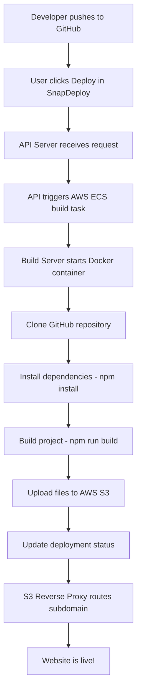

# What is SnapDeploy? 🚀

SnapDeploy is a **modern web application deployment platform** that makes it incredibly easy for developers to deploy their static websites directly from GitHub repositories to the cloud with just a few clicks.

## 🎯 What Problem Does SnapDeploy Solve?

Imagine you have a React, Vue, or static HTML website on GitHub and you want to:
- Deploy it to the internet quickly
- Get a live URL to share with others
- Automatically rebuild when you push changes
- Deploy both public and private repositories
- Monitor the deployment process in real-time

**SnapDeploy solves all of these problems!** It's like having your own personal Vercel or Netlify, but built with a clear, understandable microservices architecture.

## 🔍 What Does SnapDeploy Actually Do?

### In Simple Terms:
1. **Connect your GitHub** - Link your GitHub account securely
2. **Pick a repository** - Choose any repo with a static website
3. **Click Deploy** - SnapDeploy handles the rest automatically
4. **Get a live URL** - Your site is available at `your-project.snapdeploy.me`

### Behind the Scenes:
1. **Clones your repository** from GitHub (supports private repos too!)
2. **Installs dependencies** using `npm install`
3. **Builds your project** using `npm run build`
4. **Uploads the built files** to AWS S3 for hosting
5. **Sets up routing** so your custom subdomain works instantly
6. **Shows you real-time logs** of the entire process

## 🏗️ How is SnapDeploy Built?

SnapDeploy uses a **microservices architecture** with 4 main components:

### 1. 🖥️ Frontend (React App)
- **What it is**: The web interface you interact with
- **Technology**: React 18 + Vite + Tailwind CSS
- **What you can do**:
  - Create an account and log in
  - Connect your GitHub account
  - Browse and select repositories
  - Create and manage projects
  - Watch deployment logs in real-time
  - Configure environment variables

### 2. 🔧 API Server (Backend)
- **What it is**: The brain of SnapDeploy
- **Technology**: Node.js + Express + MongoDB
- **What it handles**:
  - User authentication (with JWT tokens)
  - GitHub OAuth integration
  - Project and deployment management
  - Triggering builds on AWS
  - Streaming real-time logs
  - Database operations

### 3. 🏭 Build Server (Docker Container)
- **What it is**: The automated build pipeline
- **Technology**: Docker + Node.js running on AWS ECS
- **What it does**:
  - Clones your GitHub repository
  - Installs all dependencies (`npm install`)
  - Builds your project (`npm run build`)
  - Uploads the built files to AWS S3
  - Sends progress updates back to the API

### 4. 🌐 S3 Reverse Proxy (Routing Server)
- **What it is**: The traffic director
- **Technology**: Node.js + Express + HTTP Proxy
- **What it does**:
  - Routes `your-project.snapdeploy.me` to the right S3 folder
  - Handles subdomain-based routing
  - Serves your deployed websites to visitors

## 📊 Real-World Example

Let's say you have a React portfolio website on GitHub:

### Step 1: You Create a Project
- Repository: `https://github.com/yourusername/my-portfolio`
- Project Name: "My Amazing Portfolio"
- Branch: `main`
- Subdomain: `amazing-portfolio` (auto-generated)

### Step 2: SnapDeploy Works Its Magic
```
✅ Connecting to GitHub...
✅ Cloning repository from main branch...
✅ Installing dependencies (npm install)...
✅ Building project (npm run build)...
✅ Uploading files to S3...
✅ Deployment successful!
🌐 Your site is live at: amazing-portfolio.snapdeploy.me
```

### Step 3: Your Site is Live!
- Visitors can access your portfolio at `amazing-portfolio.snapdeploy.me`
- The site loads fast (served from AWS S3)
- You can deploy updates by just pushing to GitHub and clicking "Deploy" again

## 🛠️ What Types of Projects Can You Deploy?

SnapDeploy works great with:

### ✅ Static Websites
- **React apps** built with Create React App, Vite, or Next.js (static export)
- **Vue.js applications** 
- **Angular projects**
- **Vanilla HTML/CSS/JavaScript** websites
- **Documentation sites** (Docusaurus, GitBook, etc.)
- **Landing pages** and marketing sites
- **Personal portfolios** and blogs

### ✅ Build Process Requirements
Your project just needs to:
- Have a `package.json` file
- Support `npm install` to install dependencies
- Have a build command (usually `npm run build`)
- Output static files to a `dist/`, `build/`, or similar folder

## 🔐 Security Features

SnapDeploy takes security seriously:

- **🔒 Encrypted GitHub Tokens**: Your GitHub access tokens are encrypted before storage
- **🛡️ JWT Authentication**: Secure token-based user authentication
- **🔐 Private Repository Support**: Can deploy private repos securely
- **✅ Input Validation**: All user inputs are validated using Zod schemas
- **🌐 CORS Protection**: Proper cross-origin request handling

## 🚀 Key Benefits

### For Developers:
- **⚡ Lightning Fast**: Deploy in seconds, not minutes
- **🔄 Easy Updates**: Redeploy with a single click
- **📊 Transparency**: See exactly what's happening with real-time logs
- **🔒 Privacy**: Deploy private repositories securely
- **🎛️ Control**: Configure environment variables and build settings

### For Projects:
- **🌐 Instant URLs**: Get a live link immediately
- **📱 Mobile Friendly**: Works on all devices
- **🔗 Easy Sharing**: Share your projects with a simple link
- **💾 Reliable Hosting**: Backed by AWS S3 infrastructure
- **📈 Scalable**: Handle traffic spikes without issues

## 🔄 Complete Deployment Workflow



## 💡 When Should You Use SnapDeploy?

### Perfect For:
- **🎨 Personal projects** and portfolios
- **🔬 Prototyping** and testing ideas quickly  
- **📚 Documentation sites** and blogs
- **🚀 Landing pages** and marketing sites
- **🎓 Student projects** and learning exercises
- **🏢 Small business websites**

### Consider Alternatives For:
- **🗄️ Full-stack applications** with databases (use Heroku, Railway)
- **🔧 Server-side rendering** needs (use Vercel, Netlify)
- **🏢 Enterprise applications** with complex requirements
- **🔌 API backends** (use dedicated hosting)

## 🎯 Summary

**SnapDeploy is your personal deployment assistant** that takes the complexity out of deploying static websites. Whether you're a beginner learning web development or an experienced developer who wants a simple deployment solution, SnapDeploy provides:

- 🎯 **Simplicity**: Deploy with just a few clicks
- 🔒 **Security**: Enterprise-grade security features
- ⚡ **Speed**: Lightning-fast deployments and loading
- 🔍 **Transparency**: See exactly what's happening
- 🆓 **Accessibility**: Easy to understand and use

It's like having a deployment expert on your team who handles all the technical details so you can focus on building amazing websites! 🚀